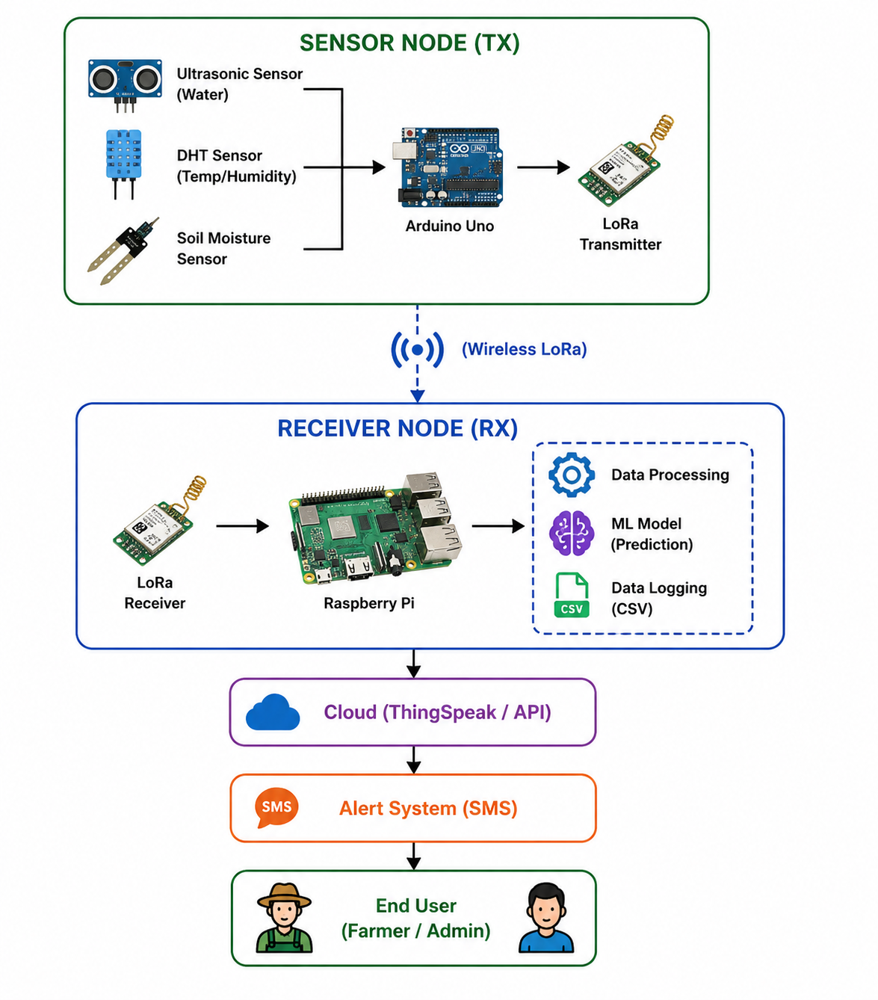
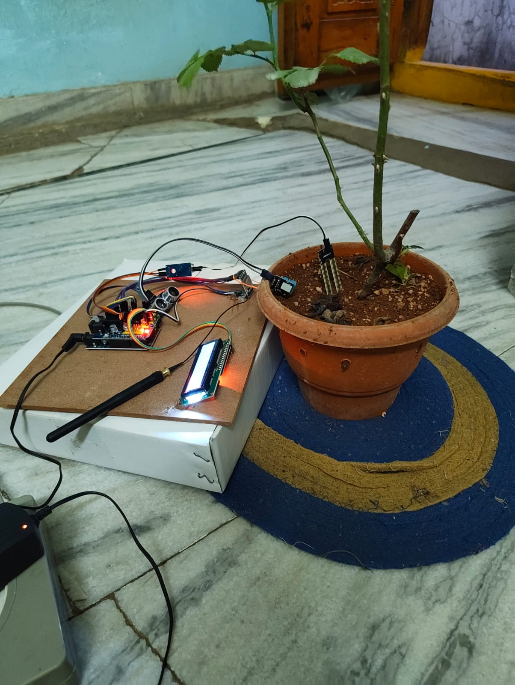
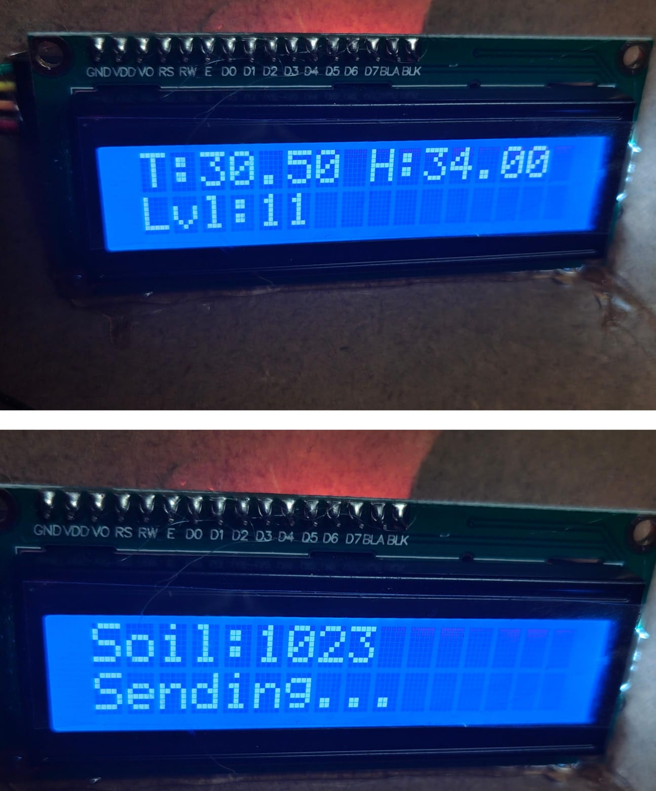
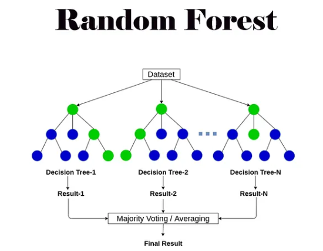
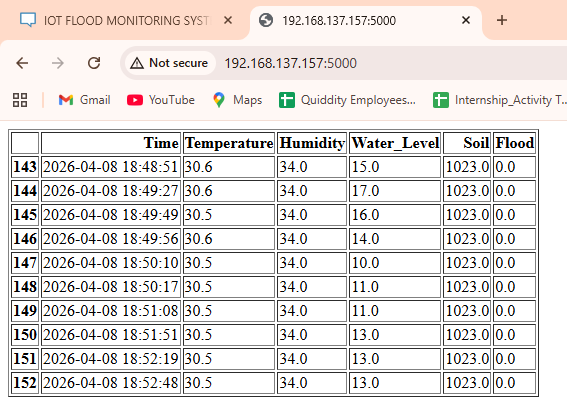
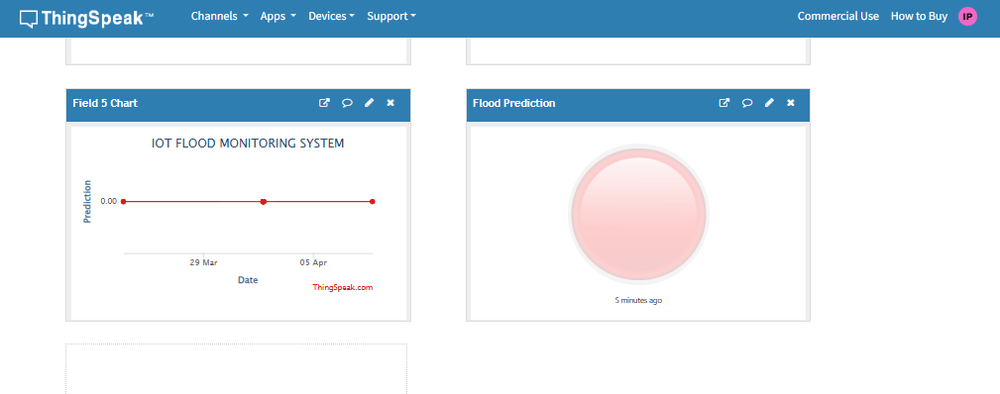
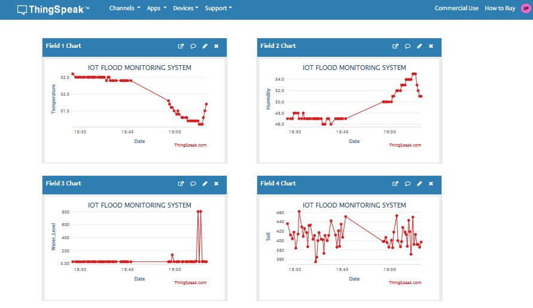
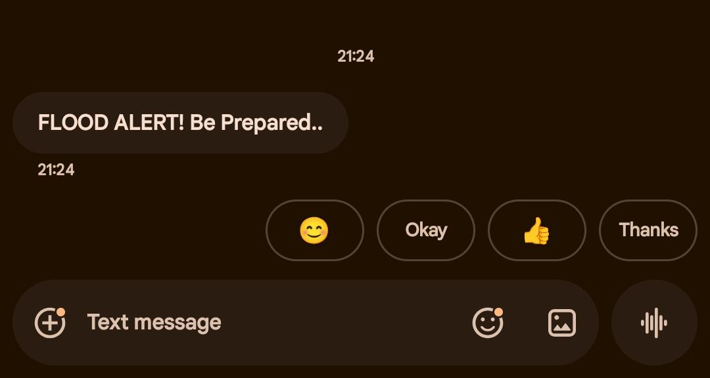

# IoT‑Based Flood Prediction System for Agricultural Fields using ML

An end‑to‑end IoT system that monitors field conditions and predicts flood risk using machine learning, sending real‑time alerts to farmers via SMS and web dashboards



---

## Overview

This project combines low‑cost sensors, Arduino‑based data acquisition, long‑range wireless communication, a Raspberry Pi gateway, and a machine learning model to provide early flood warnings in agricultural fields  
Sensor data is transmitted over a low‑power long‑range (LoRa) link to a Raspberry Pi, where it is logged, visualized, and fed into a Random Forest classifier to determine whether conditions are normal or flood‑prone


---

## Key Features

- Continuous monitoring of multiple environmental parameters (water level, soil moisture, temperature, humidity)  
- Long‑range, low‑power data transmission using LoRa between field sensor nodes and the gateway  
- Edge machine learning on Raspberry Pi using a Random Forest classifier for real‑time flood risk prediction  
- Dual alerting:
  - SMS alerts to farmers via GSM module when flood risk is detected  
  - Web dashboard and ThingSpeak channel for real‑time graphs and historical trends  
- Designed to work in rural areas with limited or no internet connectivity at the field site  

---

## System Architecture

At a high level, the system has two main parts: a **transmitter (sensor) node** in the field and a **gateway node** (Raspberry Pi) at a safer location


- **Sensor / Transmitter Node (Arduino):**  
  - Reads water level, soil moisture, temperature, and humidity.  
  - Displays readings on a 16×2 LCD.  
  - Packages readings into a comma‑separated string.  
  - Sends data via LoRa to the gateway

- **Gateway Node (Raspberry Pi):**  
  - Receives LoRa packets and logs them into a CSV file.  
  - Uploads selected fields to ThingSpeak for cloud visualization.  
  - Loads a trained Random Forest model and performs real‑time inference.  
  - Triggers SMS alerts via GSM (SIM800L/SIM900) when flood risk is predicted.  
  - Hosts a local dashboard to display live data and model output

---

## Hardware Setup

### Prototype in Test Environment



### LCD Display at Sensor Node

The LCD shows temperature, humidity, water level, and soil moisture along with a sending status during LoRa transmission.



---

## Hardware Requirements

- **Sensor / Transmitter Node:**:1]  
  - Arduino Uno  
  - HC‑SR04 ultrasonic sensor (water level)  
  - Soil moisture sensor  
  - DHT11 temperature & humidity sensor  
  - LoRa SX1278 (or similar) transmitter module  
  - 16×2 I2C LCD  
  - Jumper wires, power supply, enclosure

- **Gateway Node:**:1]  
  - Raspberry Pi 3B/4 (running Raspberry Pi OS)  
  - LoRa SX1278 (or similar) receiver module  
  - GSM module (SIM800L/SIM900) with active SIM card  
  - Stable 5 V power supply and internet connectivity (for ThingSpeak & remote access)

---

## Software Requirements

On **Arduino**:  

- Arduino IDE  
- Libraries:
  - `LoRa.h`  
  - `DHT.h`  
  - `LiquidCrystal_I2C.h`  
  - `SPI.h` and `Wire.h`

On **Raspberry Pi** (Python 3 environment):  

- `pandas`  
- `numpy`  
- `scikit-learn`  
- `joblib`  
- `requests` (for ThingSpeak HTTP API)  
- `pyserial` (for GSM / USB serial)  
- `RPi.GPIO`  
- LoRa driver library (`SX127x` Python library: `from SX127x.LoRa import LoRa` and `from SX127x.board_config import BOARD`)

---

## Repository Structure

A suggested directory structure for this repository is:

```text
.
├── arduino/
│   └── ArduinoTXcode.ino        # Arduino sensor + LoRa + LCD code
├── raspberry_pi/
│   ├── lora_server.py           # Receives LoRa data, logs to CSV, uploads to ThingSpeak
│   ├── lora_server_sms.py       # Receives LoRa data, runs ML model, sends SMS alerts
│   ├── train_model.py           # Trains Random Forest model and saves floodmodel.pkl
│   ├── test_accuracy.py         # Evaluates model (accuracy, precision, F1-score)
│   ├── flooddata.csv            # Collected dataset (sensor readings + flood labels)
│   └── floodmodel.pkl           # Saved trained Random Forest model
├── docs/
│   ├── Major_Project_Report.pdf
│   ├── Major_Project_Research_Paper.pdf
│   └── Major_Project_PPT.pptx
├── images/ 
│   └── *.jpg
└── README.md
```

The Python and Arduino files correspond to the source code segments provided in the project report and paper

---

## Getting Started

### 1. Clone the Repository

```bash
git clone https://github.com/<your-username>/<your-repo-name>.git
cd <your-repo-name>
```

### 2. Arduino: Sensor Node Setup

1. Open `arduino/ArduinoTXcode.ino` in the Arduino IDE.  
2. Select the correct board (Arduino Uno) and COM port.  
3. Install necessary libraries (`LoRa`, `DHT`, `LiquidCrystal_I2C`).  
4. Update pin definitions if your wiring differs from the code.  
5. Upload the sketch to the Arduino and verify:
   - Sensor readings are shown on the LCD.  
   - Serial monitor prints temperature, humidity, water level, and soil values.  
   - “Sending...” status appears when LoRa packets are transmitted.

---

## Model Training Workflow



1. **Collect data**  
   - Run the LoRa receiver script to log raw sensor readings from the field into `flooddata.csv` with columns like `Time`, `Temperature`, `Humidity`, `Water_Level`, `Soil`, and `Flood` (binary label 0/1).  

2. **Train the model**  

   ```bash
   cd raspberry_pi
   python3 train_model.py
   ```

   - `train_model.py` loads `flooddata.csv`, splits it into train/test sets, trains a `RandomForestClassifier`, and saves the trained model as `floodmodel.pkl`.

3. **Evaluate performance**  

   ```bash
   python3 test_accuracy.py
   ```

   - `test_accuracy.py` reports accuracy, precision, and F1-score; in testing, accuracy around 0.97 was achieved on the held‑out set

---

## Real‑Time Monitoring & Dashboards

### Local Raspberry Pi Dashboard

The Raspberry Pi hosts a simple web interface showing the latest sensor readings and model predictions from the CSV log.



### ThingSpeak Visualization

ThingSpeak is used to visualize time‑series data for temperature, humidity, water level, soil moisture, and model prediction




---

## Real‑Time Prediction & SMS Alerts

When the trained model predicts a flood condition, the Raspberry Pi triggers an SMS alert using the GSM module



1. **Run LoRa receiver + ML + SMS**

   ```bash
   cd raspberry_pi
   python3 lora_server_sms.py
   ```

   - Loads `floodmodel.pkl` and listens for incoming LoRa packets.  
   - Parses the comma‑separated sensor string into `Temperature`, `Humidity`, `Water_Level`, and `Soil` features.  
   - Calls `model.predict(...)` to classify the current condition as flood (1) or normal (0).  
   - If flood is predicted:
     - Sends SMS via the GSM module using AT commands over serial.  
     - Optionally uploads the reading and prediction to ThingSpeak

2. **Configure ThingSpeak**  
   - Create a ThingSpeak channel and note the **Write API Key**.  
   - In `lora_server.py`/`lora_server_sms.py`, set:
     - `THINGSPEAK_API` key  
     - Field mapping (e.g., field1 = temperature, field2 = humidity, field3 = water level, field4 = soil moisture, field5 = predicted label).

3. **Configure GSM / SMS**  
   - Insert a SIM card into the GSM module and ensure it registers on the network.  
   - In the GSM code section, set your phone number (e.g., `PHONE = "+91XXXXXXXXXX"`).  
   - The script uses `AT+CMGF=1` and `AT+CMGS` commands to send SMS alerts from the Pi.

---

## Results

- The Random Forest classifier achieved high accuracy and reliable classification between normal and flood‑prone conditions on the collected dataset  
- End‑to‑end tests showed low latency from sensor event to SMS reception, dominated mainly by GSM network delay but suitable for early warning at field scale  
- LoRa communication remained robust over tens to hundreds of meters on campus with obstacles, and can reach longer distances in open rural areas

---

## How to Use This Repository

- Use this repo to:
  - Reproduce the full hardware–software stack for an IoT flood prediction prototype.  
  - Extend the dataset and retrain the Random Forest model with more diverse conditions.  
  - Customize thresholds, model hyperparameters, or add additional features (e.g., rainfall or external weather data)  

- You can also:
  - Fork this project and adapt it to different crops, regions, or communication technologies.  
  - Replace the Random Forest model with more advanced ML/DL models once sufficient data is available

---

## Future Improvements

Potential extensions include

- Integrating multiple sensor nodes to cover larger agricultural regions.  
- Adding solar power for energy autonomy.  
- Experimenting with models such as LSTM for seasonal or time‑series flood prediction.  
- Building a mobile app or interactive map for better visualization and alert management.

---

## Acknowledgements

This implementation is based on the major project and research work carried out in the Department of Electronics and Instrumentation Engineering at VNR Vignana Jyothi Institute of Engineering and Technology, Hyderabad
